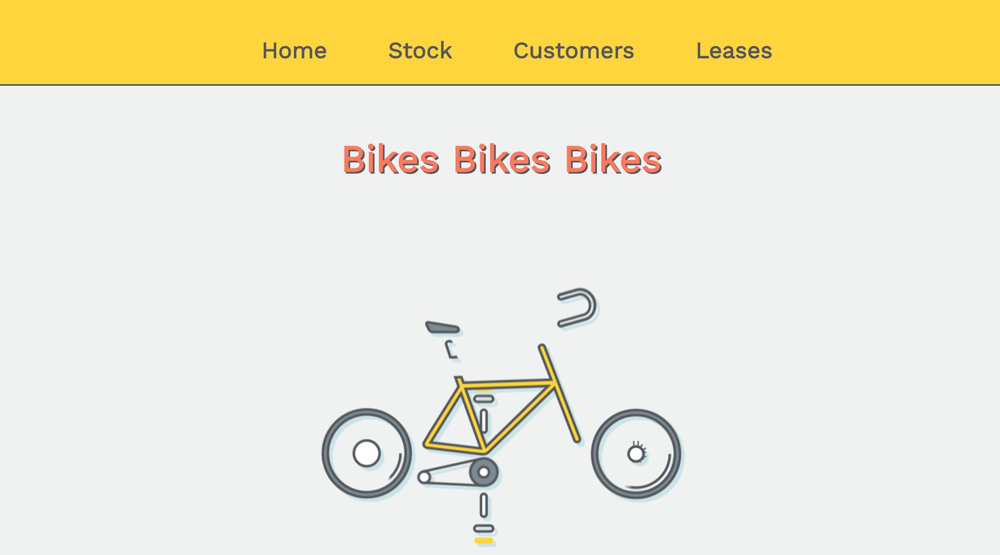
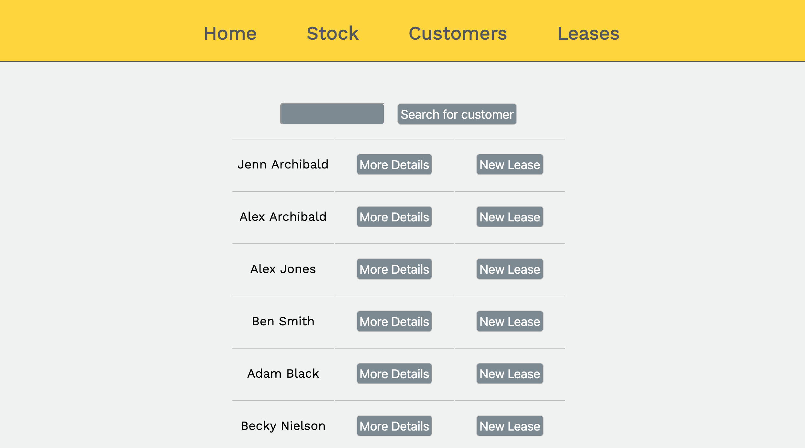

#Bike Rental Project

This project is a system for the manager of a bike rental store, designed to help them keep track of their stock, customers, and current and past leases.

It is built using PostgreSQL, ruby, and sinatra.

The completed App can be viewed at https://bikerentalproject.herokuapp.com/

This app was built as my solo week 4 ruby project for CodeClan's professional software development course. 

Building this app was my first 'real' coding project and I learned a lot along the way. It was interesting to attempt my first web app without using any javascript, which I've since learned makes almost all of the things I was trying to do so much easier to achieve.
If I was to attempt this project again, I think I would try to consider the UX of the site a little more, especially when adding new functionalities and trying to find a logical place to place them within the site's navigation. 
Overall, I'm proud of what I was able to accomplish so soon into the course, particularly the search bar in the customers view, which I feel really added to the usability of the app and was a really fun challenge to figure out.

[Version 0.1.0](https://github.com/jennarchibald/bike_rental_project/tree/67867fd0ae6a306d1a6af637e1c3da2b8c8a8868)

-Allows for creation, editing and deletion of customers and stock items.

-Allows for filtering the index of stock items by type.

-Allows for searching for customers by name.

-Allows for creation and editing of leases.

-Allows for filtering of leases by status (active, returned and overdue).

[Version 1.1.0](https://github.com/jennarchibald/bike_rental_project/tree/7b18faecbe20df1d0cd30340811a1024b94c3bb3)

- Allows for multiple items to be added to each lease.

- Improved customer search function

- Improved CSS styling and layout

[Version 1.1.1](https://github.com/jennarchibald/bike_rental_project/tree/73605e32febed5641631d7f4de4d8a691cd86ba6)

- Improved CSS Layout
